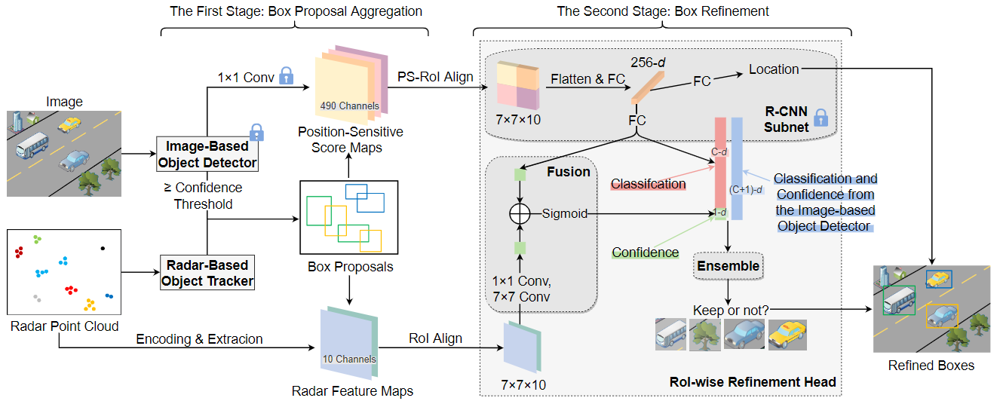

# milliEye
This is the repo for IoTDI 2021 paper: "milliEye: A Lightweight mmWave Radar and Camera Fusion System for Robust Object Detection".

<br>

# Requirements
The program has been tested in the following environment: 
* Ubuntu 18.04
* Python 3.6.8
* Pytorch 1.5.0 
* torchvision 0.6.0
* tensorboardX 2.0
* opencv-python 4.5.1.48
* scikit-learn 0.24.1
* scipy 1.5.4
* numpy 1.19.5

<br>

# milliEye Overview
<p align="center" >
	
</p>

We perform three-stage training:  
* 1st stage: Train image-based object detector (e.g., YOLO) on Mixed dataset of COCO and ExDark
* 2nd stage: Fixed the image-based object detector; train the R-CNN on Mixed dataset of COCO and ExDark
* 3rd stage: Fixed the image-based object detector and the R-CNN; train other parts on radar/camera multi-modality dataset

<br>

# Project Strcuture
```
|-- data                    // folder to store data
    |-- coco/
    |-- ExDark/
    |-- mixed/
    |-- data/
    |-- our_dataset/

|-- module3_our_dataset/    // code for the 3rd stage training
    |-- checkpoints/        // obtained checkpoints from the 3rd stage training
    |-- config/
    |-- data_collection/    // code for data collection and preparation
    |-- utils/
    |-- weights/            // store the trained YOLO, YOLO+RCNN (2nd stage)
    |-- yolov3/             // YOLOv3 Project 
    |-- my_models.py        // milliEye model definition
    |-- train.py         
    |-- test_fusion.py      // test the mAP
    |-- run_sp.py           // demo using single-process
    |-- run_mp.py           // demo using multi-process
    |-- README.md

|-- module2_mixed/          // code for the 2nd stage training

|-- pictures               // figures used this README.md
```

<br>


# Run
## Quick Start
* Download the `/checkpoints` and `/weights` folders from [Onedrive](https://mycuhk-my.sharepoint.com/:f:/g/personal/1155118647_link_cuhk_edu_hk/EpkycykJuuJAiKr_9plZ3HoB3-s9_GPmSUX-wFrHfjc_hg?e=KGKzsc) 
* Run the following code
    ```bash
    cd module3_our_dataset
    python3 run_mp.py
    ```
## Implement Your Model
### Collection Customized Radar/Camera Dataset
* Hardware
    * Common USB2.0 camera
    * Texas Instrument IWR6843ISK ES1.0 (ES2.0 is also supported by the script)
* Code: see the `./module3_our_dataset/data_collection/README.md` for details   
    * First use `collect.py` to collect data
    * Then use `prepare_data.py` for dataset preparation

### 1st Stage Training: YOLO
* Dataset downloading
    * COCO train_val 2014: https://cocodataset.org/#home 
    * ExDark: https://github.com/cs-chan/Exclusively-Dark-Image-Dataset 
    * Only keep 12 out of 80 classes of the COCO
* Dataset preparing and training
    * First need to transform ExDark dataset into COCO's format, please follow the instruction at: https://github.com/ultralytics/yolov3/wiki/Train-Custom-Data 

### 2nd Stage Training: YOLO + R-CNN
will come soon
## 3rd Stage Training
See `module3_our_dataset/`

<br>

# Citation
If you find this work useful for your research, please cite:
``` 
"Xian Shuai, Yulin Shen, Yi Tang, Shuyao Shi, Luping Ji, and Guoliang Xing, milliEye: A Lightweight mmWave Radar and Camera Fusion System for Robust Object Detection. In Proceedings of Internet of Things Design and Implementation (IoTDI’21)."
```
The Bibtex version will come soon. 

# Demo
See [YOLO/Radar/milliEye Demo](`./pictures/indoor.gif`).


